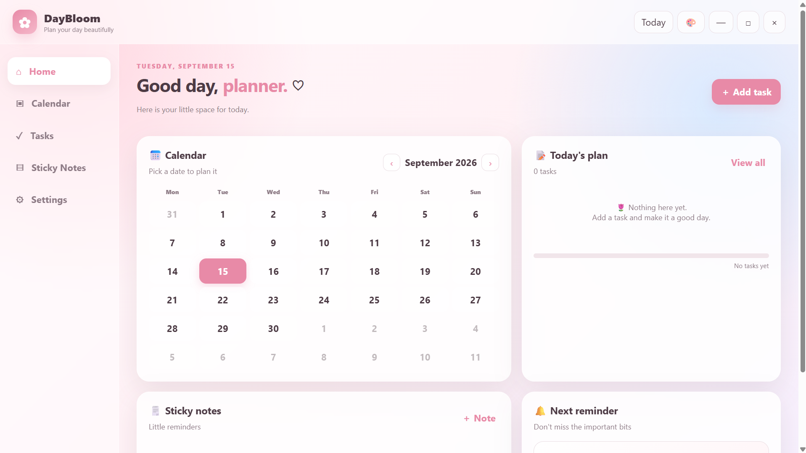
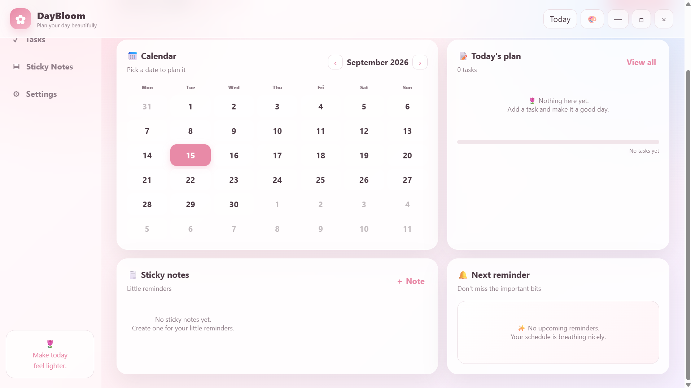
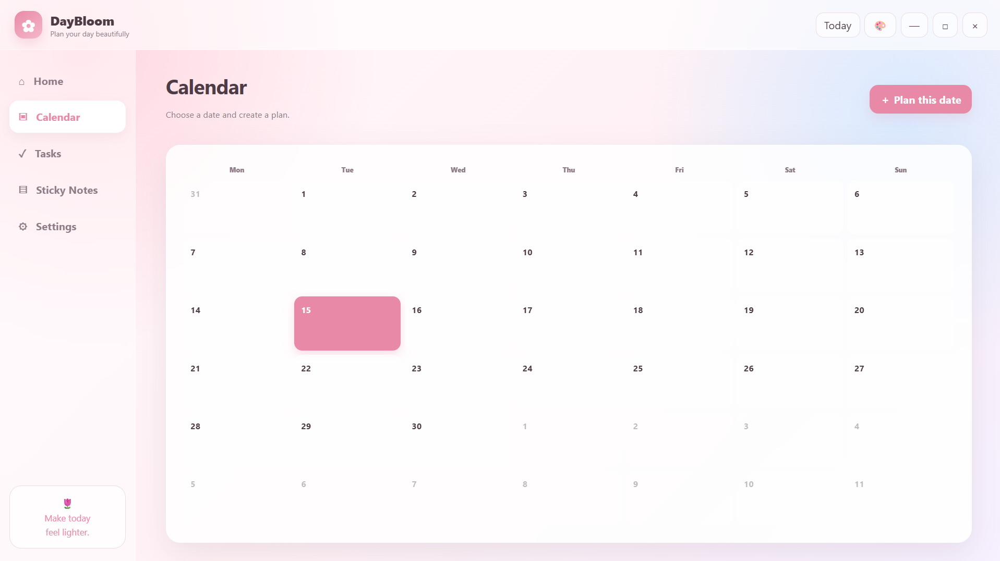
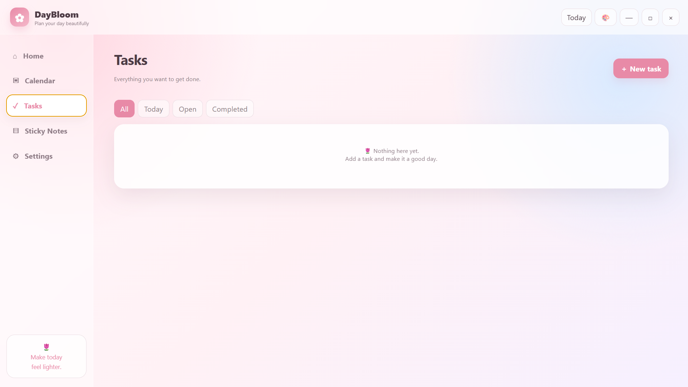
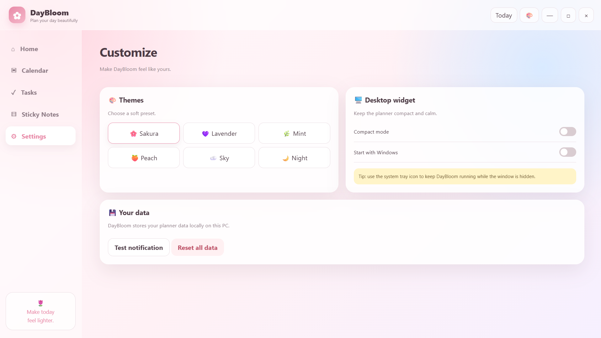

# 🌸 DayBloom

### ✨ Plan Your Day. Organize Your Life. Bloom Every Day.

<p align="center">
  
</p>

<p align="center">
  <b>A modern desktop productivity and planning application designed to help you organize tasks, manage your schedule, and stay focused.</b>
</p>

<p align="center">


</p>

---

## 🌱 About DayBloom

**DayBloom** is a modern desktop productivity application designed for people who want a simple and beautiful way to organize their daily activities.

It combines **task management, calendar planning, reminders, monthly goals, and customization** into one easy-to-use application.

Instead of using multiple applications to manage your everyday activities, DayBloom brings everything together in one place.

> **Plan your day → Complete your tasks → Build better habits → Bloom every day 🌸**

---

## ✨ Features

### 📝 Smart Task Management

* Create and manage daily tasks
* Mark tasks as completed
* Edit and delete tasks
* Organize tasks easily
* Track your daily progress

### 📅 Calendar Planner

* Monthly calendar view
* Select specific dates
* Add plans to individual dates
* View scheduled activities
* Organize important events

### 🔔 Custom Reminders

* Create reminders for important tasks
* Customize reminder times
* Never miss important activities
* Manage reminders easily

### 🎯 Monthly Planning

* Add important goals for the month
* Track monthly activities
* Organize personal and academic work
* Maintain a clear overview of your month

### 🎨 Customization

* Modern user interface
* Customizable themes
* Personalized experience
* Clean and responsive design

### 📊 Productivity Overview

* Monitor completed tasks
* View daily activity
* Track productivity
* Understand your progress

---

## 🖥️ Application Preview

### 🏠 Dashboard

<p align="center">
  
</p>
<p align="center">
  
</p>

The dashboard provides a quick overview of your tasks, plans, reminders, and productivity.

---

### 📅 Calendar

<p align="center">
  
</p>

Plan your activities by selecting a specific date and adding your schedule.

---

### ✅ Task Management

<p align="center">
  
</p>

Create, manage, and complete tasks from a simple productivity interface.

---

### ⚙️ Settings & Customization

<p align="center">
  
</p>

Customize the application according to your personal preferences.

---

## 🛠️ Technologies Used

<p align="center">


</p>

---

## 🏗️ Project Structure

```text
DayBloom/
│
├── assets/
│   ├── banner.png
│   ├── dashboard.png
│   ├── calendar.png
│   ├── tasks.png
│   └── settings.png
│
├── src/
│   ├── components/
│   ├── pages/
│   ├── styles/
│   └── ...
│
├── src-tauri/
│   ├── src/
│   ├── icons/
│   └── tauri.conf.json
│
├── package.json
├── package-lock.json
└── README.md
```

---

## 🚀 Getting Started

### 1. Clone the Repository

```bash
git clone YOUR_REPOSITORY_URL
```

### 2. Navigate to the Project

```bash
cd DayBloom
```

### 3. Install Dependencies

```bash
npm install
```

### 4. Run the Application

```bash
npm run dev
```

---

## 💻 Development

The application is designed as a desktop productivity solution with a modern frontend and desktop application environment.

Development workflow:

```text
User
  │
  ▼
DayBloom Interface
  │
  ├── Tasks
  ├── Calendar
  ├── Reminders
  ├── Monthly Plans
  └── Settings
  │
  ▼
Local Application Data
```

---

## 🎯 Main Goals

DayBloom was developed with the following goals:

* 📌 Make daily planning easier
* 📌 Reduce task management complexity
* 📌 Improve productivity
* 📌 Provide an attractive user interface
* 📌 Keep important plans in one place
* 📌 Help users build consistent daily routines

---

## 🔮 Future Improvements

Future versions of DayBloom may include:

* ☁️ Cloud synchronization
* 📱 Mobile application
* 🔐 User authentication
* 📈 Advanced productivity analytics
* 🔔 Advanced notification system
* 🎨 More themes
* 🌙 Advanced dark mode
* 📤 Data export and backup
* 🔄 Cross-device synchronization
* 🤖 AI-powered planning assistant

---

## 📌 Roadmap

| Feature               | Status |
| --------------------- | :----: |
| Task Management       |    ✅   |
| Calendar              |    ✅   |
| Daily Planning        |    ✅   |
| Reminders             |    ✅   |
| Monthly Planning      |    ✅   |
| Theme Customization   |    ✅   |
| Productivity Tracking |   🚧   |
| Cloud Sync            |   🔜   |
| Mobile App            |   🔜   |
| AI Assistant          |   🔜   |

---

## 📸 Screenshots

<p align="center">
  
  
</p>" width="400">
  
</p>

<p align="center">
  
  
</p>

---

## 👨‍💻 Developer

<p align="center">

### 🌸 DayBloom

**Designed & Developed with ❤️**

A personal productivity project focused on making everyday planning simple, organized, and enjoyable.

</p>

---

## ⭐ Support

If you find **DayBloom** useful or interesting:

⭐ Give the repository a star
🍴 Fork the project
🐛 Report issues
💡 Suggest new features

Your support helps the project grow! 🌱

---

## 📄 License

This project is developed for educational and personal project purposes.

---

<p align="center">

### 🌸 Plan. Focus. Achieve. Bloom. 🌸

**Made with ❤️ for better days.**

</p>
